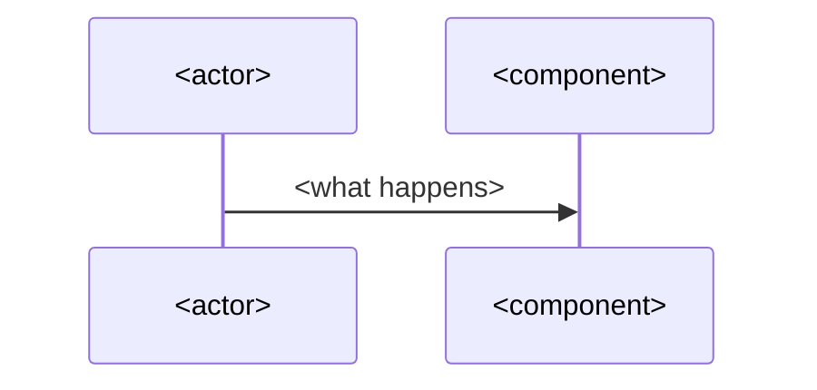

# How <technology> works

<Two short paragraphs: the problem it solves, and what it adds that the reader would otherwise do by hand. Link its official overview page.>

## How it works

<The mechanism in full sentences, in the order things happen. A mermaid sequence diagram for a process over time, a flowchart for how parts connect. Every claim links the kubernetes.io or official page section that supports it.>

## How it fits in the cluster

<How it connects to the parts the reader already knows, and how it differs from a similar tool or idea, with when to use each. Link the Learn pages and reference pages for those parts.>

<If the current behaviour differs from what an older version did, state the current behaviour first and the old one in a closing sentence.>

The commands, errors and other facts are on the [<name> reference page](../references/<page>.md).

## Further reading

- [<official page title>](https://kubernetes.io/docs/...)
- [<project's own docs, spec or talk>](https://...) (not available in the exam)
