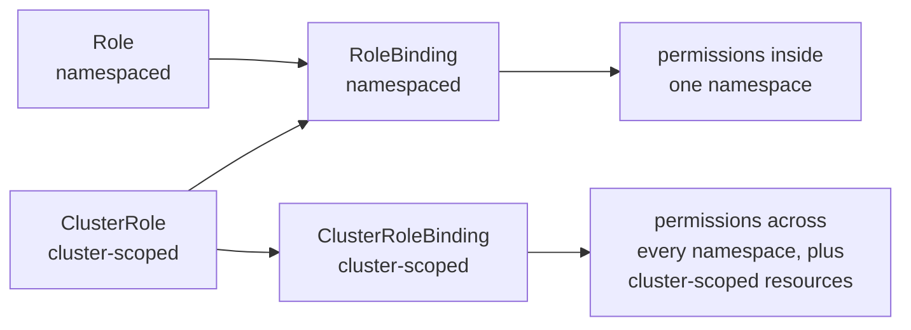
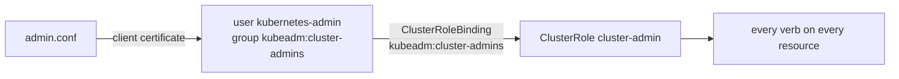

# How access control works

Every request to the apiserver answers two questions in order. Authentication asks who sent it, and turns the request's credential into a username and a list of groups. Authorization asks whether that identity may do what it asks, and on a kubeadm cluster RBAC, role-based access control, answers ([controlling access to the Kubernetes API](https://kubernetes.io/docs/concepts/security/controlling-access/)). The two are separate: a request can be authenticated perfectly and still be refused.

## Identities

Kubernetes has no User or Group object ([users in Kubernetes](https://kubernetes.io/docs/reference/access-authn-authz/authentication/#users-in-kubernetes)). A user exists only because a credential names one. For a client certificate, the common name becomes the username and each organisation becomes a group ([X509 client certificates](https://kubernetes.io/docs/reference/access-authn-authz/authentication/#x509-client-certificates)). So you cannot list users, and a permission can be granted to a name that no credential has ever used.

ServiceAccounts are the exception. They are objects, made for software running in the cluster, and the apiserver issues their tokens and mounts one into each pod ([service accounts](https://kubernetes.io/docs/concepts/security/service-accounts/)).

## RBAC

RBAC has four objects in two pairs. A Role or ClusterRole lists permissions, each a set of verbs on resources in API groups. A RoleBinding or ClusterRoleBinding grants a role to subjects, which are users, groups or ServiceAccounts ([RBAC](https://kubernetes.io/docs/reference/access-authn-authz/rbac/#role-and-clusterrole)). A role that is never bound grants nothing.

The pairs cross in one direction only. A RoleBinding may grant a ClusterRole, and the permissions still apply only in the binding's namespace, so one ClusterRole can serve as a shared definition for many namespaces. A namespaced Role can never be granted cluster-wide.

Permissions only add up. There is no deny rule, so a subject may do anything that any of its bindings allows, and taking access away means removing bindings.

## Putting it together

The admin `kubectl` on a kubeadm cluster shows the whole chain:

The certificate in the kubeconfig authenticates you. A binding names your group, not your user, and grants a role. Changing any link changes what you can do.

The roles, commands and errors are on the reference pages: [RBAC](../references/rbac.md), [authentication](../references/authentication.md), [ServiceAccounts](../references/service-accounts.md) and [API groups](../references/api-groups.md).

## Further reading

- [Controlling access to the Kubernetes API](https://kubernetes.io/docs/concepts/security/controlling-access/)
- [Authenticating](https://kubernetes.io/docs/reference/access-authn-authz/authentication/)
- [Using RBAC authorization](https://kubernetes.io/docs/reference/access-authn-authz/rbac/)
- [RBAC good practices](https://kubernetes.io/docs/concepts/security/rbac-good-practices/)
