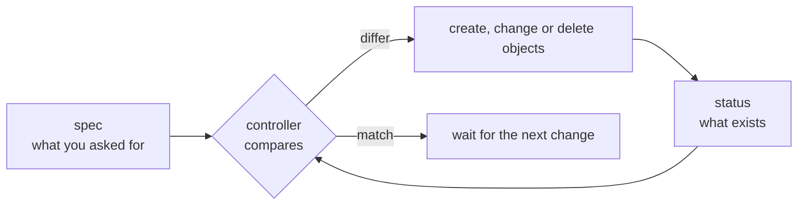
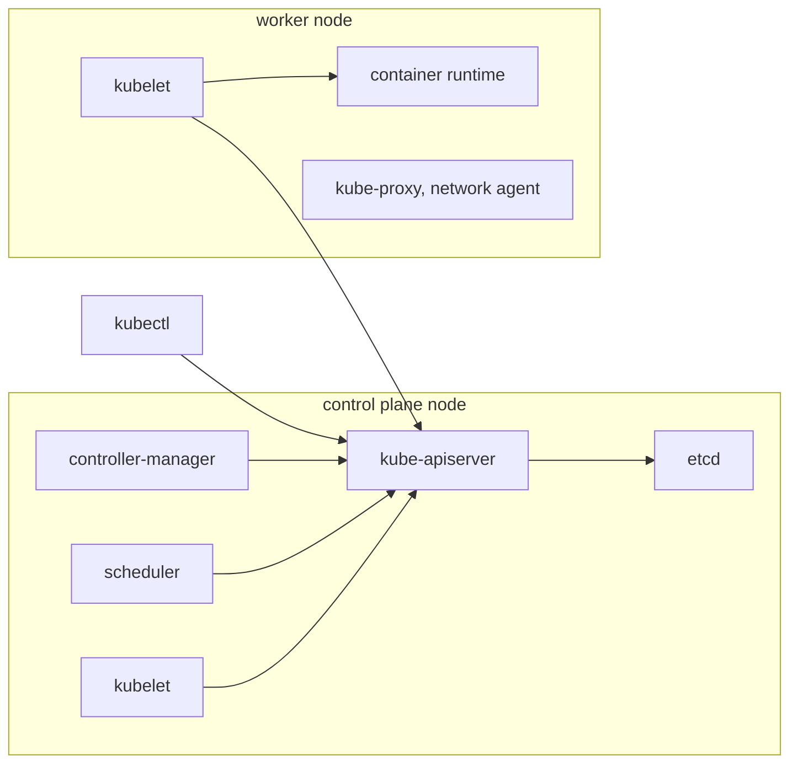
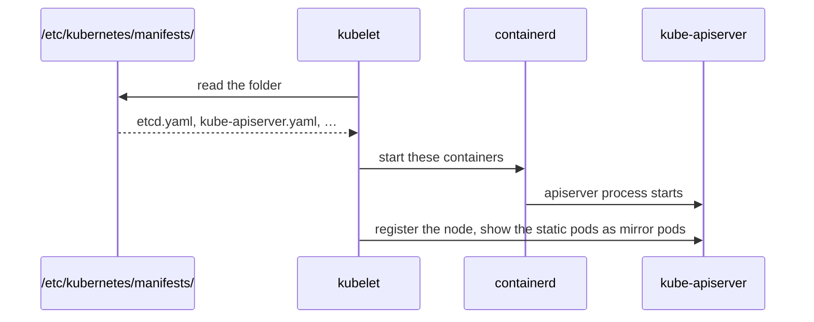

# How a Kubernetes cluster works

Kubernetes runs containers across a group of machines and keeps them running the way you asked. You never tell it to start a container on a machine. You write down the state you want, such as "three copies of this web server", and the cluster works out the rest and keeps correcting it when something breaks.

## Desired state and controllers

Every object in Kubernetes has two halves: `spec`, the state you want, and `status`, the state the cluster last observed ([object spec and status](https://kubernetes.io/docs/concepts/overview/working-with-objects/#object-spec-and-status)). A controller is a loop that compares the two for one kind of object and acts on the difference ([controller pattern](https://kubernetes.io/docs/concepts/architecture/controller/#controller-pattern)). If a Deployment asks for three pods and two exist, its controller creates one more. If a node dies, the pods on it are gone and the controllers create new ones elsewhere.

This is why most work in Kubernetes is editing objects, not running commands on machines. It is also why deleting a pod that a Deployment owns does nothing lasting: the Deployment still asks for it, so a new one appears.

## The control plane and the nodes

A cluster has two kinds of machine. The control plane stores the desired state and runs the controllers. Nodes run the workloads ([cluster components](https://kubernetes.io/docs/concepts/overview/components/#core-components)).

The apiserver is the centre. It is the only component that reads or writes etcd, the database that holds every object, and everything else, `kubectl` included, talks to the apiserver ([control-plane components](https://kubernetes.io/docs/concepts/overview/components/#control-plane-components)). The controller-manager runs the built-in controllers. The scheduler picks a node for each new pod and writes the node's name into the pod, and does nothing else.

Every node, the control plane node included, runs a kubelet ([node components](https://kubernetes.io/docs/concepts/overview/components/#node-components)). The kubelet watches the apiserver for pods assigned to its node and asks the container runtime, such as containerd, to start their containers through the container runtime interface (CRI), a standard API that lets Kubernetes work with more than one runtime ([CRI](https://kubernetes.io/docs/concepts/architecture/cri/)). The kubelet is the only part that actually starts containers.

So a new pod passes through four components: `kubectl` sends it to the apiserver, the apiserver stores it in etcd, the scheduler assigns it a node, and that node's kubelet starts it.

## How the control plane starts itself

The apiserver runs as a pod, yet pods are created through the apiserver. The kubelet breaks that loop with static pods: it reads pod manifests from a folder on disk, `/etc/kubernetes/manifests/`, and starts them with no apiserver involved ([static pods](https://kubernetes.io/docs/tasks/configure-pod-container/static-pod/)).

The file is the source of truth for a static pod. Editing it restarts the component, and deleting the pod through the apiserver only deletes the mirror, which the kubelet puts back.

## Pods, and the objects that own them

A pod is one or more containers that share an IP address and can share storage. It is the smallest thing the scheduler places, and it stays on its node for life. A pod that seems to have moved is a new pod made by a controller. You rarely create pods directly. A Deployment keeps a number of identical pods running, and a DaemonSet keeps one pod on every node, which is how node agents such as kube-proxy and the pod network's agent are installed.

Namespaces divide one cluster into named groups of objects, and labels tag objects so other objects can select them, such as a Service choosing its pods.

The facts for each part are on the reference pages: [control plane](../references/control-plane.md), [workers](../references/workers.md), [pods](../references/pod.md), [DaemonSets](../references/daemonsets.md), [namespaces](../references/namespaces.md) and [labels](../references/labels.md).

## Further reading

- [Cluster architecture](https://kubernetes.io/docs/concepts/architecture/)
- [Kubernetes components](https://kubernetes.io/docs/concepts/overview/components/)
- [Controllers](https://kubernetes.io/docs/concepts/architecture/controller/)
- [Objects in Kubernetes](https://kubernetes.io/docs/concepts/overview/working-with-objects/)
- [Kubernetes the hard way](https://github.com/kelseyhightower/kubernetes-the-hard-way), which builds every component by hand (not available in the exam)
