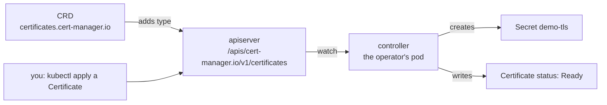

# How CRDs and operators extend Kubernetes

Kubernetes ships with types such as Pod and Deployment, and many tools need types of their own. A certificate manager wants a Certificate, and a database tool wants a Database. A CustomResourceDefinition (CRD) adds a new type to the apiserver without changing Kubernetes, and an operator adds the behaviour behind it ([custom resources](https://kubernetes.io/docs/concepts/extend-kubernetes/api-extension/custom-resources/)).

## What a CRD adds

A CRD describes a type: its group, its versions, whether its objects live in a namespace, and a schema for its fields. Once created, the apiserver serves the new type at its own path and treats its objects like built-in ones. `kubectl get`, `apply`, `explain`, RBAC rules and namespaces all work with it.

A CRD adds storage and validation, but no behaviour. An object of the new type is a record in etcd that nothing reads until a controller does.

## Operators

An operator is a controller for custom types. It runs in the cluster as ordinary pods, watches objects of its types, and reconciles: it compares what each object asks for with what exists and creates, changes or deletes objects until they match ([operator pattern](https://kubernetes.io/docs/concepts/extend-kubernetes/operator/)). This is the same loop the built-in controllers run for Deployments, applied to a new type ([how a cluster works](cluster-architecture.md#desired-state-and-controllers)).

Because the operator keeps reconciling, you configure it by changing its custom objects, never the objects it made. A Secret it created and you deleted comes back within seconds, because the Certificate still asks for it. The operator reports progress in each object's `status`, which is what a `READY` column shows.

An operator needs three things installed: its CRDs, its controller pods, and a ServiceAccount with RBAC permission for the objects it manages. A Helm chart usually installs all three.

The fields, commands and errors are on the [CRDs and operators reference page](../references/crds.md).

## Further reading

- [Custom resources](https://kubernetes.io/docs/concepts/extend-kubernetes/api-extension/custom-resources/)
- [Extend the Kubernetes API with CustomResourceDefinitions](https://kubernetes.io/docs/tasks/extend-kubernetes/custom-resources/custom-resource-definitions/)
- [Operator pattern](https://kubernetes.io/docs/concepts/extend-kubernetes/operator/)
- [cert-manager concepts](https://cert-manager.io/docs/concepts/) (not available in the exam)
