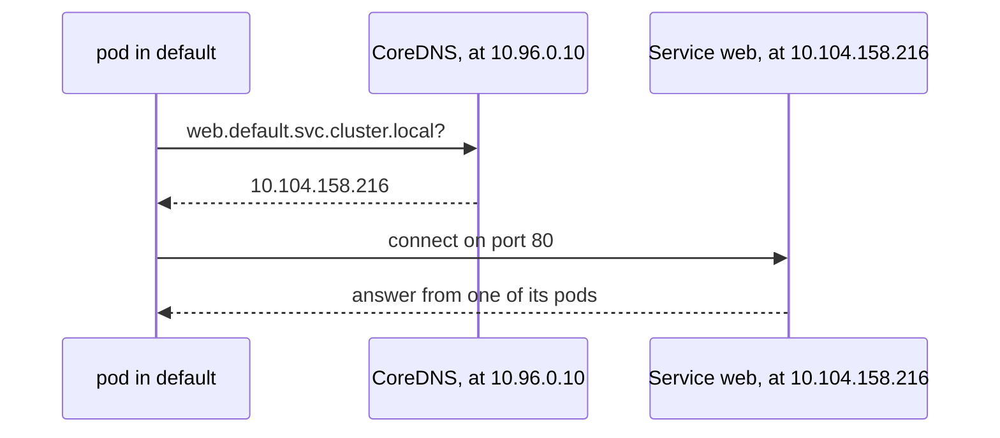
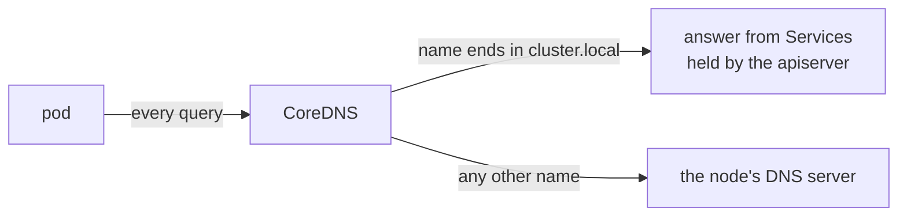

# How DNS works in the cluster

A pod reaches a Service by name, such as `web`, rather than by its IP address. DNS, the system that turns names into addresses, makes that work inside the cluster as it does on the internet. Kubernetes gives every Service a DNS name and points every pod at the cluster's own DNS server, [CoreDNS](../references/pod-network.md#coredns) ([DNS for Services and Pods](https://kubernetes.io/docs/concepts/services-networking/dns-pod-service/)).

Without it, a client would need each Service's IP address, which is only known once the Service exists and changes if the Service is created again. A name stays the same.

## How it works

The kubelet writes each pod's `/etc/resolv.conf`, the file Linux programs read to find their DNS server. A pod in `default` gets:

```
search default.svc.cluster.local svc.cluster.local cluster.local
nameserver 10.96.0.10
options ndots:5
```

`nameserver` is the address of the `kube-dns` Service, which sends queries to the CoreDNS pods. The kubelet takes it from its own `clusterDNS` setting, and `cluster.local` from `clusterDomain`. `search` lists suffixes to try after a short name, starting with the pod's own namespace. `ndots:5` means a name with fewer than five dots is tried with each suffix before it is tried as written ([namespaces of Services](https://kubernetes.io/docs/concepts/services-networking/dns-pod-service/#namespaces-of-services)).

So `web` from a pod in `default` is looked up as `web.default.svc.cluster.local` first:



Each Service gets a record `<service>.<namespace>.svc.cluster.local` that points to its ClusterIP ([A/AAAA records](https://kubernetes.io/docs/concepts/services-networking/dns-pod-service/#a-aaaa-records)). The same `web` from a pod in `dev` becomes `web.dev.svc.cluster.local`, which does not exist, so a pod reaches a Service in another namespace as `web.default`.

## How it fits in the cluster

CoreDNS is a Deployment in `kube-system`, behind the Service `kube-dns`. Its configuration, the Corefile, is in the ConfigMap `coredns` ([CoreDNS ConfigMap options](https://kubernetes.io/docs/tasks/administer-cluster/dns-custom-nameservers/#coredns-configmap-options)). Two of its lines do most of the work: `kubernetes cluster.local` answers names in the cluster domain from the Services and pods the apiserver holds, and `forward . /etc/resolv.conf` passes every other name, such as `kubernetes.io`, to the DNS server of the node CoreDNS runs on.



A pod uses CoreDNS because its `dnsPolicy` is `ClusterFirst`, the policy a pod gets when none is set ([pod's DNS policy](https://kubernetes.io/docs/concepts/services-networking/dns-pod-service/#pod-s-dns-policy)). CoreDNS needs a pod address like any other pod, so it does not start until the pod network works, and a cluster whose CoreDNS pods are not running cannot resolve any Service name ([how the pod network works](pod-network.md)).

A pod's `resolv.conf`, the Corefile and the commands to look a name up are with CoreDNS on the pod network reference page, linked above, and Service names and their failures are on the [Services reference page](../references/services.md).

## Further reading

- [DNS for Services and Pods](https://kubernetes.io/docs/concepts/services-networking/dns-pod-service/)
- [Customizing DNS Service](https://kubernetes.io/docs/tasks/administer-cluster/dns-custom-nameservers/)
- [Debugging DNS resolution](https://kubernetes.io/docs/tasks/administer-cluster/dns-debugging-resolution/)
- [CoreDNS manual](https://coredns.io/manual/toc/) (not available in the exam)
