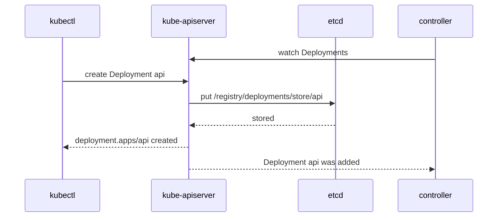
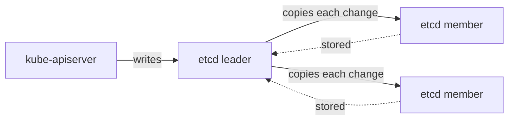

# How etcd stores the cluster

Every object in a cluster, from a pod to a Role, exists only as an entry in etcd, a consistent and highly available key-value store that Kubernetes uses for all its data ([operating etcd clusters](https://kubernetes.io/docs/tasks/administer-cluster/configure-upgrade-etcd/)). The other components keep nothing of their own that the cluster could not rebuild. Lose etcd's data and the cluster forgets every object it had, which is why it is the one thing in a cluster that needs a backup.

Without etcd, each component would have to store the state it cares about and agree with the others on it. With etcd, there is one record that every change goes into and every component reads from, through the apiserver.

## How it works

The apiserver is etcd's only client. It checks each request, then writes the object to etcd under a key built from its type, namespace and name, such as `/registry/deployments/store/api` for the Deployment `api` in `store`, or `/registry/namespaces/store` for the namespace itself. The value is the object in a compact binary encoding, not the YAML you wrote.

Controllers, the scheduler and kubelets never read etcd. They watch the apiserver, which sends them each change to the objects they follow as it happens ([efficient detection of changes](https://kubernetes.io/docs/reference/using-api/api-concepts/#efficient-detection-of-changes)):

etcd runs as a cluster of members, each with a full copy of the data. One member is the leader, which sends every change to the others and sends them regular heartbeats ([operating etcd clusters](https://kubernetes.io/docs/tasks/administer-cluster/configure-upgrade-etcd/#before-you-begin)). A change counts as stored once a majority of members, called the quorum, have it. With `n` members the quorum is `(n/2)+1`, so 3 members keep working with 1 down, and 5 with 2 down. An even number adds no tolerance: 4 members still survive only 1 failure. This is why the docs say to run an odd number of members, and recommend five in production ([multi-node etcd cluster](https://kubernetes.io/docs/tasks/administer-cluster/configure-upgrade-etcd/#multi-node-etcd-cluster)).

Members talk to each other on port 2380 and to clients on port 2379, both over TLS, the encryption HTTPS uses, with certificates signed by etcd's own CA, the key that vouches for them ([securing etcd clusters](https://kubernetes.io/docs/tasks/administer-cluster/configure-upgrade-etcd/#securing-etcd-clusters), [how TLS secures the cluster](tls.md)).

## How it fits in the cluster

kubeadm runs one etcd member on each control plane node, as a static pod, a pod the kubelet starts from a file on the machine, next to the apiserver. This is the stacked topology, the kubeadm default. Losing a node then costs both an etcd member and a control plane instance, so a highly available cluster needs at least three control plane nodes ([stacked etcd topology](https://kubernetes.io/docs/setup/production-environment/tools/kubeadm/ha-topology/#stacked-etcd-topology)). The other choice, external etcd, runs the members on machines of their own, which needs twice as many machines ([external etcd topology](https://kubernetes.io/docs/setup/production-environment/tools/kubeadm/ha-topology/#external-etcd-topology)). A single control plane node, as kubeadm builds by default, has a single member, which is its own leader.

etcd holds objects, not what they point to. Container images, the files in volumes and container logs live on the nodes and in storage systems, so an etcd backup brings back every object but none of that data. A backup is a snapshot of the whole key space taken with `etcdctl` ([backing up an etcd cluster](https://kubernetes.io/docs/tasks/administer-cluster/configure-upgrade-etcd/#backing-up-an-etcd-cluster)), and restoring it puts the cluster back to the moment of the snapshot.

The etcd pod and the other control plane components are on the [control plane reference page](../references/control-plane.md#components), and etcd's certificate files are on the [certificates reference page](../references/certificates.md#on-a-kubeadm-cluster).

## Further reading

- [Operating etcd clusters for Kubernetes](https://kubernetes.io/docs/tasks/administer-cluster/configure-upgrade-etcd/)
- [Options for highly available topology](https://kubernetes.io/docs/setup/production-environment/tools/kubeadm/ha-topology/)
- [Kubernetes API concepts](https://kubernetes.io/docs/reference/using-api/api-concepts/)
- [etcd FAQ](https://etcd.io/docs/v3.6/faq/), which explains quorum and failure tolerance (not available in the exam)
