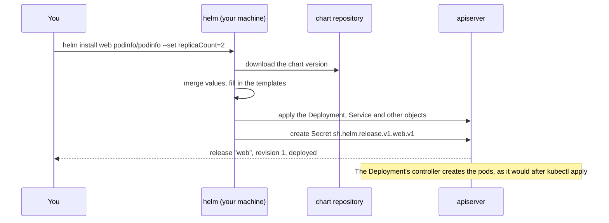
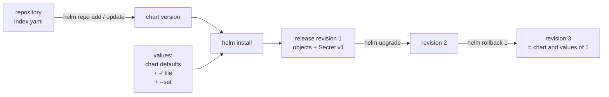

# How Helm works

An application in Kubernetes is rarely one object. A web app is a Deployment, a Service, a ConfigMap, a ServiceAccount and often more, and `kubectl apply` treats each of them as separate. Nothing records that these objects belong together, which version of the app they are, or what they looked like before the last change. A Deployment keeps its own rollout history, but a ConfigMap or a Service keeps none, so undoing a bad change means finding and reverting every file by hand.

Helm adds three things on top of `kubectl`. It packages an application's manifests as a chart that anyone can install. It lets one chart serve many installs through values, the settings each install changes. It keeps a numbered history of every install, so the whole application can be upgraded, rolled back or removed as one unit ([what Helm can do](https://helm.sh/docs/intro/introduction/#what-can-helm-do)).

## How it works

A chart is a folder of templates, which are Kubernetes manifests with gaps in them, plus a `values.yaml` file that fills each gap with a default ([the chart file structure](https://helm.sh/docs/topics/charts/#the-chart-file-structure)). A release is one installed copy of a chart, with its own name, in one namespace.

When you run `helm install`, everything up to the last step happens on your own machine. Helm merges the chart's defaults with the values you give, fills in the templates, and sends the finished manifests to the apiserver. It then saves a record of the release (the chart, the values and the manifests) as a Secret in the release's namespace. From Helm 4 on, a new release is applied with server-side apply, in which the apiserver records which tool owns each field of an object ([server-side apply](https://helm.sh/docs/overview/#server-side-apply), [field management](https://kubernetes.io/docs/reference/using-api/server-side-apply/#field-management)).

Each later upgrade or rollback renders the chart again and adds the next revision, stored as one more Secret. A rollback never deletes history. It creates a new revision that repeats the chart and values of an older one.

## How it fits in the cluster

Helm has no part running inside the cluster. It is a command-line tool that talks to the apiserver with the same kubeconfig as `kubectl`, so it can do only what that kubeconfig's user is allowed to do ([architecture](https://helm.sh/docs/intro/introduction/#architecture), [RBAC](../references/rbac.md)).

Helm creates objects and then stops. It does not watch them afterwards, so the Deployment's controller creates and replaces the pods, and if someone edits an object with `kubectl`, Helm does not notice until the next upgrade. An operator is different, because it runs in the cluster and keeps correcting its objects ([CRDs and operators](../references/crds.md)).

Kustomize solves a similar problem in a different way. It is built into `kubectl`, it changes plain YAML with patches instead of filling in templates, and it keeps no release history ([Kustomize](../references/kustomize.md)). Use Helm to install software someone else packaged as a chart, and use Kustomize to keep variants of your own manifests.

Helm 2 ran a server component called Tiller inside the cluster, which held its own permissions. Helm 3 removed it and moved the release records into Secrets ([removal of Tiller](https://helm.sh/docs/faq/changes_since_helm2/#removal-of-tiller)).

The commands, the rules for values, and the error messages are on the [Helm reference page](../references/helm.md).

## Further reading

- [Introduction to Helm](https://helm.sh/docs/intro/introduction/)
- [Charts](https://helm.sh/docs/topics/charts/)
- [Helm 4 overview](https://helm.sh/docs/overview/)
- [Changes since Helm 2](https://helm.sh/docs/faq/changes_since_helm2/)
- [Server-side apply](https://kubernetes.io/docs/reference/using-api/server-side-apply/)
