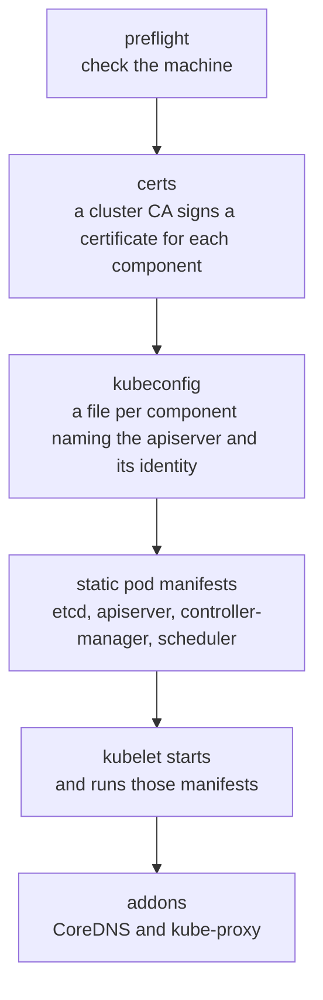
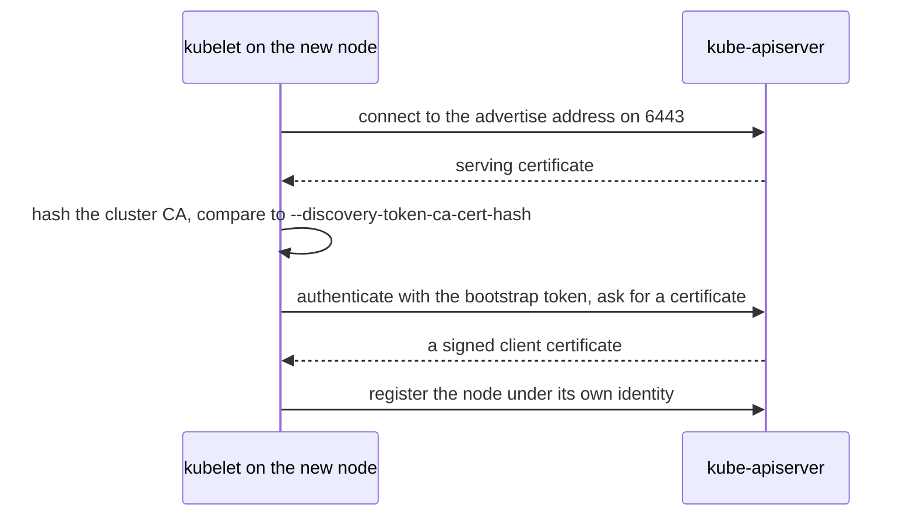

# How kubeadm builds a cluster

A cluster needs more than its programs. Every component needs a certificate so the others can trust it, a kubeconfig that says where the apiserver is, and a way to start before the apiserver exists. kubeadm does that setup. It turns machines that already have a container runtime and a kubelet into a cluster, and it leaves out everything a cluster can choose for itself, such as the pod network ([kubeadm init](https://kubernetes.io/docs/reference/setup-tools/kubeadm/kubeadm-init/)).

## Building the control plane

`kubeadm init` runs on the machine that becomes the control plane, in a fixed order where each step depends on the one before ([init workflow](https://kubernetes.io/docs/reference/setup-tools/kubeadm/kubeadm-init/#init-workflow)):

Certificates come first because everything after them uses them. The cluster CA, a certificate authority that kubeadm creates, signs a certificate for every component. A component trusts another one when its certificate was signed by that CA. The apiserver's own certificate lists every address it answers on. A client that connects on any other address refuses the connection, which is why kubeadm asks for the advertise address up front and why changing it later means building the control plane again.

The control plane components are written as static pod manifests, files the kubelet reads straight from disk, so they start without an apiserver to ask ([how a cluster works](cluster-architecture.md#how-the-control-plane-starts-itself)).

## Joining a node

A new node and the control plane start with no trust in either direction. The join command carries one secret each way ([TLS bootstrapping](https://kubernetes.io/docs/reference/access-authn-authz/kubelet-tls-bootstrapping/)):

The CA hash lets the node check that it reached the right cluster. The bootstrap token lets the apiserver accept the node for long enough to sign it a certificate, and it expires after 24 hours ([bootstrap tokens](https://kubernetes.io/docs/reference/access-authn-authz/bootstrap-tokens/)). After the join, the node proves who it is with its own certificate, and the token is no longer needed.

## What kubeadm leaves out

kubeadm installs no pod network, so a new cluster's nodes stay `NotReady` until you install one ([how the pod network works](pod-network.md)). It also installs no storage, ingress or dashboard, which leaves those choices to whoever runs the cluster.

The phases, files, commands and errors are on the reference pages: [kubeadm](../references/kubeadm.md) and [workers](../references/workers.md#joining).

## Further reading

- [Creating a cluster with kubeadm](https://kubernetes.io/docs/setup/production-environment/tools/kubeadm/create-cluster-kubeadm/)
- [kubeadm implementation details](https://kubernetes.io/docs/reference/setup-tools/kubeadm/implementation-details/)
- [PKI certificates and requirements](https://kubernetes.io/docs/setup/best-practices/certificates/)
- [TLS bootstrapping](https://kubernetes.io/docs/reference/access-authn-authz/kubelet-tls-bootstrapping/)
