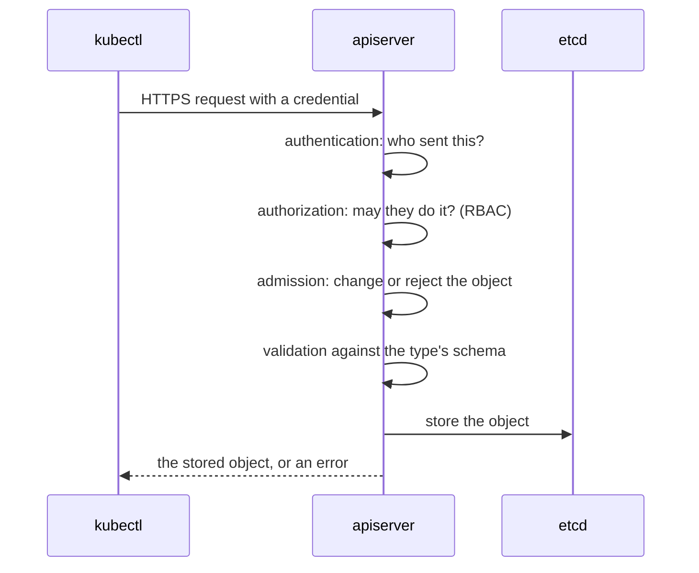

# How kubectl talks to the cluster

`kubectl` is a client for the Kubernetes API, an HTTP interface on the apiserver. Every command, from `get` to `apply` to `edit`, becomes one or more HTTP requests to the apiserver, and every other component works through the same API ([the Kubernetes API](https://kubernetes.io/docs/concepts/overview/kubernetes-api/)). Knowing what happens to those requests explains most errors you will see.

## Finding the cluster

`kubectl` reads a kubeconfig file to learn the apiserver's address, the CA certificate to check it with, and the credential to send. The file holds clusters, users and contexts, where a context pairs one cluster with one user and a default namespace ([organizing cluster access](https://kubernetes.io/docs/concepts/configuration/organize-cluster-access-kubeconfig/)). Without a kubeconfig, `kubectl` tries `localhost:8080` and fails, which is the error on any machine that has none.

## What happens to a request

The apiserver passes each request through the same stages ([controlling access to the Kubernetes API](https://kubernetes.io/docs/concepts/security/controlling-access/)):

Each stage has its own error. `Unauthorized` means authentication failed, `Forbidden` means authorization refused, and `is invalid` means the object broke its schema ([authentication](https://kubernetes.io/docs/concepts/security/controlling-access/#authentication), [authorization](https://kubernetes.io/docs/concepts/security/controlling-access/#authorization), [admission control](https://kubernetes.io/docs/concepts/security/controlling-access/#admission-control)).

## Types, groups and versions

Every type lives at a path under an API group and version, such as `/apis/apps/v1/deployments` ([API groups and versioning](https://kubernetes.io/docs/concepts/overview/kubernetes-api/#api-groups-and-versioning)). The group and version are an object's `apiVersion`, `apps/v1` for a Deployment and just `v1` for the oldest, core types such as pods. The apiserver publishes a schema for every type, and `kubectl explain` reads it from there, so it describes the exact version your cluster runs, including types added later by CRDs.

## Three ways to change objects

`kubectl` offers three ways to manage objects ([management techniques](https://kubernetes.io/docs/concepts/overview/working-with-objects/object-management/#management-techniques)):

| Way | Example | When it fits |
| --- | --- | --- |
| Imperative commands | `kubectl create deployment web --image=nginx` | One-off changes, and the fastest path. |
| Imperative object configuration | `kubectl create -f web.yaml`, `kubectl replace -f web.yaml` | Working from a file you keep. |
| Declarative object configuration | `kubectl apply -f web.yaml` | Files that you edit and apply again and again. |

`apply` remembers each file it applied in an annotation on the object, `kubectl.kubernetes.io/last-applied-configuration`, and compares the next file with it, so it can tell a field you deleted from one you never set ([how apply calculates differences](https://kubernetes.io/docs/tasks/manage-kubernetes-objects/declarative-config/#how-apply-calculates-differences-and-merges-changes)).

The commands combine. `kubectl create … --dry-run=client -o yaml` builds an object on your machine without sending it and prints it as YAML, so you get a correct file to edit before you apply it.

The shortcuts and checks are on the [kubectl reference page](../references/kubectl.md), and the kubeconfig details on the [kubeconfig reference page](../references/kubeconfig.md).

## Further reading

- [The Kubernetes API](https://kubernetes.io/docs/concepts/overview/kubernetes-api/)
- [Controlling access to the Kubernetes API](https://kubernetes.io/docs/concepts/security/controlling-access/)
- [Object management](https://kubernetes.io/docs/concepts/overview/working-with-objects/object-management/)
- [kubectl quick reference](https://kubernetes.io/docs/reference/kubectl/quick-reference/)
