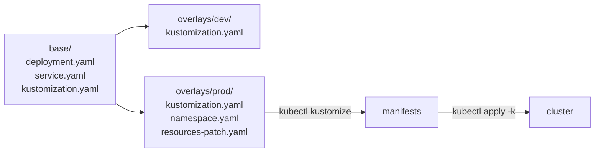

# How Kustomize works

The same application often runs in several places, such as development and production, with small differences: another namespace, more replicas, a different image tag. Copying the manifests for each place means every fix has to be made several times. Kustomize keeps one copy of the manifests and describes each place as a list of changes on top of it ([overview of Kustomize](https://kubernetes.io/docs/tasks/manage-kubernetes-objects/kustomization/#overview-of-kustomize)).

## Bases and overlays

A base is a folder of ordinary manifests plus a `kustomization.yaml` that lists them. An overlay is a folder whose `kustomization.yaml` names the base and the changes to make ([bases and overlays](https://kubernetes.io/docs/tasks/manage-kubernetes-objects/kustomization/#bases-and-overlays)). Building the overlay reads the base, applies the changes in memory, and prints the result. The base files never change.

Every file stays valid Kubernetes YAML. There are no templates and no placeholders, so the base can be applied on its own, and a change is either a field in `kustomization.yaml`, such as `namespace` or `images`, or a patch: a partial manifest holding only the fields to change.

## Names that change with their contents

A ConfigMap or Secret built by Kustomize gets a hash of its contents added to its name, and every reference to it in the same build is rewritten to match ([generating resources](https://kubernetes.io/docs/tasks/manage-kubernetes-objects/kustomization/#generating-resources)). This turns a configuration change into a rollout. Running pods do not see a new value in an existing ConfigMap's environment variables, but a new name changes the Deployment's pod template, so the Deployment replaces its pods.

## Kustomize compared with Helm

Both produce a set of objects from files, and they solve different problems. Helm fills templates with values and records a release that it can upgrade and roll back. Kustomize changes plain YAML and records nothing. `kubectl apply -k` sends its output like any other manifests. Use Helm to install software someone else packaged, and Kustomize to keep variants of your own manifests ([how Helm works](helm.md)).

The fields, patches, commands and errors are on the [Kustomize reference page](../references/kustomize.md).

## Further reading

- [Declarative management of Kubernetes objects using Kustomize](https://kubernetes.io/docs/tasks/manage-kubernetes-objects/kustomization/)
- [kubectl kustomize](https://kubernetes.io/docs/reference/kubectl/generated/kubectl_kustomize/)
- [Kustomize documentation](https://kubectl.docs.kubernetes.io/references/kustomize/) (not available in the exam)
