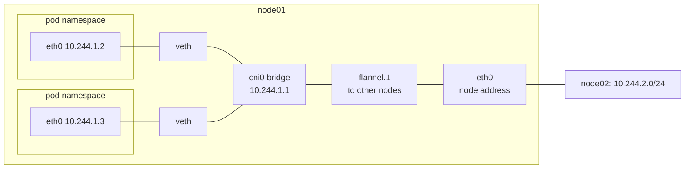

# How a pod gets its own network

Every pod has its own IP address, its own `localhost` and its own ports, even though many pods share one machine. Two pods on a node can both listen on port 80 without a clash. Linux makes that possible with network namespaces, and the pod network plugin, the program that connects pods to each other, sets them up ([pod networking](https://kubernetes.io/docs/concepts/workloads/pods/#pod-networking)).

A network namespace is a separate copy of a Linux machine's network: its own interfaces, addresses, routes and firewall rules. A program inside one sees only that copy. Without namespaces, every container on a node would share the node's addresses and ports, and two web servers could not both use port 80.

## How it works

When a pod starts, the container runtime, the program that starts containers, creates a network namespace for it, and every container in the pod joins that one namespace, which is why they share an IP address and reach each other on `localhost` ([pod networking](https://kubernetes.io/docs/concepts/workloads/pods/#pod-networking)). The runtime then calls the network plugin through [CNI](../references/pod-network.md), the standard interface for such plugins, and the plugin connects the new namespace to the node ([network plugins](https://kubernetes.io/docs/concepts/extend-kubernetes/compute-storage-net/network-plugins/)). With [Flannel](../references/pod-network.md#plugins), a common plugin, that takes three parts:

- A veth pair is two virtual network interfaces joined like the two ends of a cable: what goes in one end comes out of the other. One end goes inside the pod's namespace as `eth0`, and the other stays on the node.
- A bridge is a virtual network switch inside the Linux kernel. Flannel's bridge on each node is `cni0`, and the node end of every pod's veth pair is plugged into it, so the pods on one node reach each other through it.
- The pod gets an address from its node's slice of the pod range, such as `10.244.1.2` on the node given `10.244.1.0/24`, and a default route through the bridge's address, `10.244.1.1`.

## How it fits in the cluster

Pods on one node talk through the bridge. For a pod on another node, the node's routing table sends the packet to `flannel.1`, a VXLAN interface: it wraps each pod packet inside a UDP packet addressed from one node to the other, on port 8472, and the receiving node unwraps it and hands it to its own bridge. The node network only ever sees node addresses, which is how pod addresses work across machines that know nothing about them ([how to implement the Kubernetes network model](https://kubernetes.io/docs/concepts/cluster-administration/networking/#how-to-implement-the-kubernetes-network-model)).

Not every pod gets a namespace of its own. A pod with `hostNetwork: true`, such as the apiserver or kube-proxy, stays in the node's namespace and uses the node's address, which is how those pods run before any pod network exists ([how the pod network works](pod-network.md#when-the-network-is-missing)).

Service addresses take no part in this. No namespace or interface holds one; kube-proxy rewrites packets sent to a Service address on their way out of the pod's node ([Services](../references/services.md#how-a-service-ip-answers)).

The commands to see a node's namespaces, veth pairs, bridge and routes, with their output, are on the [pod network reference page](../references/pod-network.md#network-namespaces-on-a-node).

## Further reading

- [Pods: pod networking](https://kubernetes.io/docs/concepts/workloads/pods/#pod-networking)
- [Cluster networking](https://kubernetes.io/docs/concepts/cluster-administration/networking/)
- [Network plugins](https://kubernetes.io/docs/concepts/extend-kubernetes/compute-storage-net/network-plugins/)
- [network_namespaces(7)](https://man7.org/linux/man-pages/man7/network_namespaces.7.html), the Linux manual page (not available in the exam)
- [Flannel backends](https://github.com/flannel-io/flannel/blob/master/Documentation/backends.md), including VXLAN (not available in the exam)
