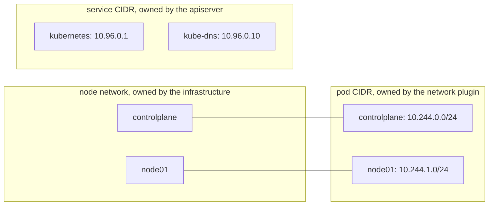
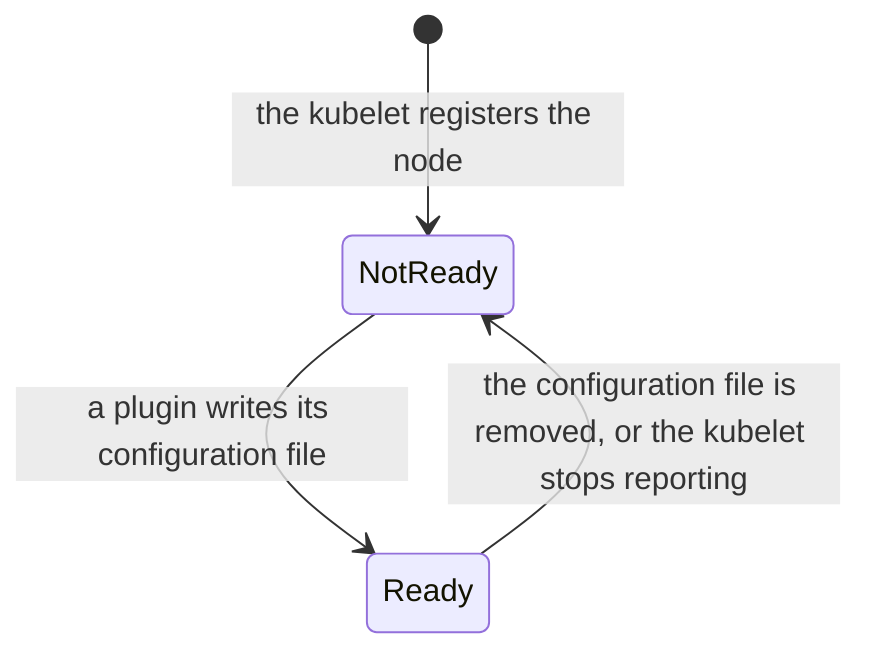

# How the pod network works

Kubernetes sets three rules for networking: every pod gets its own IP address, any pod can reach any other pod on any node without address translation, and agents on a node can reach every pod on that node ([the Kubernetes network model](https://kubernetes.io/docs/concepts/services-networking/#the-kubernetes-network-model)). Kubernetes does not implement these rules itself. A network plugin does, and there are many to choose from.

## CNI plugins

The container network interface (CNI) is a standard for how a container runtime asks a plugin to connect a container to a network ([network plugins](https://kubernetes.io/docs/concepts/extend-kubernetes/compute-storage-net/network-plugins/)). When the kubelet starts a pod, the runtime calls the plugin named in `/etc/cni/net.d/`, and the plugin gives the pod an address and connects it.

A plugin usually comes in two parts: that configuration file on every node, and an agent pod on every node, installed as a DaemonSet, which carries traffic between nodes. Plugins differ in how they carry it and in what else they do. Flannel connects pods and nothing more, while Calico also enforces NetworkPolicy, the rules that limit which pods may talk to which.

## Three address ranges

A cluster uses three separate ranges, and they must not overlap:

The node network is the machines' own addresses. The pod CIDR is a range of addresses written as a first address and a prefix length: `10.244.0.0/16` is every address whose first 16 bits match `10.244.0.0`. It is split into one smaller range per node, and the plugin hands out pod addresses from it. The service CIDR holds the stable addresses of Services.

Service addresses are different from the other two. No network interface holds one. kube-proxy, a program that runs on every node, writes packet-forwarding rules there that send traffic for a Service address to one of its pods ([virtual IPs](https://kubernetes.io/docs/reference/networking/virtual-ips/)), so a Service address answers but never appears in `ip addr`.

## When the network is missing

A node reports `Ready` only once a network configuration file exists in `/etc/cni/net.d/`. Until a plugin is installed, every node is `NotReady` and pods that need a pod address wait.

Some pods do not wait. The control plane static pods, kube-proxy and the plugin's own agent use the node's network instead of a pod address (`hostNetwork: true`), which is how they run before the pod network exists. CoreDNS, the cluster's DNS server, needs a pod address, so it is the first pod to show whether the network works.

The ranges, the readiness messages and the plugin commands are on the [pod network reference page](../references/pod-network.md).

## Further reading

- [Cluster networking](https://kubernetes.io/docs/concepts/cluster-administration/networking/)
- [Network plugins](https://kubernetes.io/docs/concepts/extend-kubernetes/compute-storage-net/network-plugins/)
- [Virtual IPs and service proxies](https://kubernetes.io/docs/reference/networking/virtual-ips/)
- [The CNI specification](https://github.com/containernetworking/cni/blob/main/SPEC.md) (not available in the exam)
