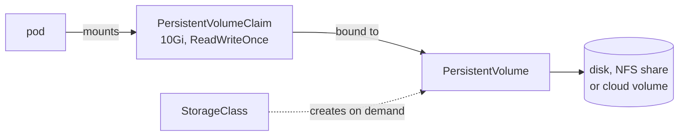

# How storage works for pods

A container's files are lost when the container stops. That suits a web server that only serves what its image holds, but not a database, or two containers that need to share files. Kubernetes adds volumes: directories that a pod's containers mount, whose contents can outlive a container and, for some kinds, the pod itself ([why volumes are important](https://kubernetes.io/docs/concepts/storage/volumes/#why-volumes-are-important)).

## How it works

A container's filesystem is built from its image's read-only layers with one writable layer on top. Everything the container writes goes into that top layer, and a restarted container starts again from the image with an empty one. So a file written inside a container is gone after it crashes and the kubelet restarts it ([why volumes are important](https://kubernetes.io/docs/concepts/storage/volumes/#why-volumes-are-important)).

A volume is declared once in the pod's `spec.volumes` and mounted by each container that needs it under `volumeMounts`, at a path such as `/data` ([how volumes work](https://kubernetes.io/docs/concepts/storage/volumes/#how-volumes-work)). What happens to its contents depends on its kind:

| Kind | Holds | Lasts |
| --- | --- | --- |
| `emptyDir` | an empty directory on the node, created with the pod | as long as the pod is on that node; a container crash does not touch it ([emptyDir](https://kubernetes.io/docs/concepts/storage/volumes/#emptydir)) |
| `hostPath` | a file or directory from the node's own filesystem | as long as the node keeps it, and a pod on another node sees that node's copy instead ([hostPath](https://kubernetes.io/docs/concepts/storage/volumes/#hostpath)) |
| `configMap`, `secret` | the keys of a [ConfigMap](../references/config.md) or [Secret](../references/config.md#secrets), one file each | as long as the object exists ([configMap](https://kubernetes.io/docs/concepts/storage/volumes/#configmap)) |
| `persistentVolumeClaim` | storage the cluster provides, such as a network disk | independently of any pod ([persistentVolumeClaim](https://kubernetes.io/docs/concepts/storage/volumes/#persistentvolumeclaim)) |

A container that writes one line to a file in its own filesystem and one to a file in an `emptyDir`, then exits, finds one line in the first file and one more in the second on each restart: the first file starts over, the second keeps growing.

## How it fits in the cluster

Storage that outlives pods is split into two objects, so that the people who run a cluster and the people who run applications each deal with their own half ([persistent volumes](https://kubernetes.io/docs/concepts/storage/persistent-volumes/#introduction)). A PersistentVolume is a piece of storage in the cluster, such as one network disk, created by an administrator or on demand. A PersistentVolumeClaim is a pod's request for storage of a size and access mode. Kubernetes binds each claim to one volume that fits it, and the pod mounts the claim, never the volume directly ([binding](https://kubernetes.io/docs/concepts/storage/persistent-volumes/#binding)).

A StorageClass names a kind of storage and the program that creates it, so a claim that names a class gets a new PersistentVolume made for it instead of waiting for an administrator ([dynamic provisioning](https://kubernetes.io/docs/concepts/storage/persistent-volumes/#dynamic)). The programs that create and attach volumes for a storage system are mostly CSI drivers. CSI (Container Storage Interface) is the standard for storage plugins, as CNI is for network plugins, so a new storage system needs a driver and no change to Kubernetes ([CSI](https://kubernetes.io/docs/concepts/storage/volumes/#csi)).

etcd holds these objects but none of the data in them, so a PersistentVolume's contents survive only as long as the storage behind it ([how etcd stores the cluster](etcd.md)).

## Further reading

- [Volumes](https://kubernetes.io/docs/concepts/storage/volumes/)
- [Persistent Volumes](https://kubernetes.io/docs/concepts/storage/persistent-volumes/)
- [Storage Classes](https://kubernetes.io/docs/concepts/storage/storage-classes/)
- [Ephemeral Volumes](https://kubernetes.io/docs/concepts/storage/ephemeral-volumes/)
- [The CSI specification](https://github.com/container-storage-interface/spec/blob/master/spec.md) (not available in the exam)
