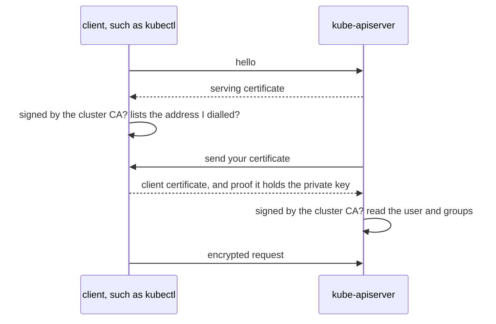
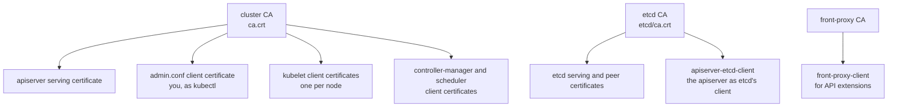

# How TLS secures the cluster

The parts of a cluster talk to each other over the network: `kubectl` to the apiserver, the apiserver to etcd and to every kubelet, each kubelet back to the apiserver. Each connection needs two things: nobody in between may read or change it, and each side must know who is on the other end. TLS (Transport Layer Security), the protocol behind HTTPS, provides both, and the apiserver accepts only TLS connections, on port 6443 by default ([transport security](https://kubernetes.io/docs/concepts/security/controlling-access/#transport-security)).

Kubernetes uses TLS for identity as well as privacy. A user that the apiserver knows from a certificate needs no password and no user object: the certificate says who they are.

## How it works

Each side of a connection holds a key pair. The private key never leaves its machine. The public key is published inside a certificate, a file that ties it to a name and is signed by a CA (certificate authority), a signer both sides trust. Checking a certificate means checking that signature against the CA's own certificate, which each side keeps a copy of ([PKI certificates and requirements](https://kubernetes.io/docs/setup/best-practices/certificates/)).

When a client connects, the two sides check each other before any request is sent:

The client trusts the apiserver only if the serving certificate was signed by a CA in its kubeconfig and lists the name or IP address it connected to ([server certificates](https://kubernetes.io/docs/setup/best-practices/certificates/#server-certificates)). When the client also sends a certificate, both sides are checked, which is called mutual TLS. The apiserver then takes the user name from the certificate's common name (`CN`) and the groups from its organisation (`O`) fields, and [RBAC](../references/rbac.md) decides what that user may do ([client certificates](https://kubernetes.io/docs/setup/best-practices/certificates/#client-certificates)).

## How it fits in the cluster

kubeadm creates three CAs and signs every other certificate with one of them ([single root CA](https://kubernetes.io/docs/setup/best-practices/certificates/#single-root-ca)):

Everything that talks to the apiserver carries the cluster CA's certificate to check it with: each kubeconfig holds a copy, and every pod gets one too, so a program in a pod can check the apiserver it calls. etcd has a CA of its own, so a certificate signed for the apiserver cannot be used to reach etcd directly. A new node gets its kubelet's client certificate when it joins, through a signing request that the cluster approves ([how kubeadm builds a cluster](kubeadm.md#joining-a-node)).

Certificates expire. kubeadm signs the component certificates for one year and the CAs for ten, and `kubeadm certs renew` signs new ones ([certificate management with kubeadm](https://kubernetes.io/docs/tasks/administer-cluster/kubeadm/kubeadm-certs/)). An expired certificate fails the check like one from the wrong CA, so `kubectl` with an expired `admin.conf` no longer reaches the apiserver.

The file for each certificate, the commands to read one and the errors a mismatch causes are on the [certificates reference page](../references/certificates.md), and how the apiserver reads users from certificates is on the [authentication reference page](../references/authentication.md).

## Further reading

- [PKI certificates and requirements](https://kubernetes.io/docs/setup/best-practices/certificates/)
- [Certificate management with kubeadm](https://kubernetes.io/docs/tasks/administer-cluster/kubeadm/kubeadm-certs/)
- [Controlling access to the Kubernetes API](https://kubernetes.io/docs/concepts/security/controlling-access/)
- [TLS bootstrapping](https://kubernetes.io/docs/reference/access-authn-authz/kubelet-tls-bootstrapping/)
- [RFC 8446, the TLS 1.3 standard](https://www.rfc-editor.org/rfc/rfc8446) (not available in the exam)
