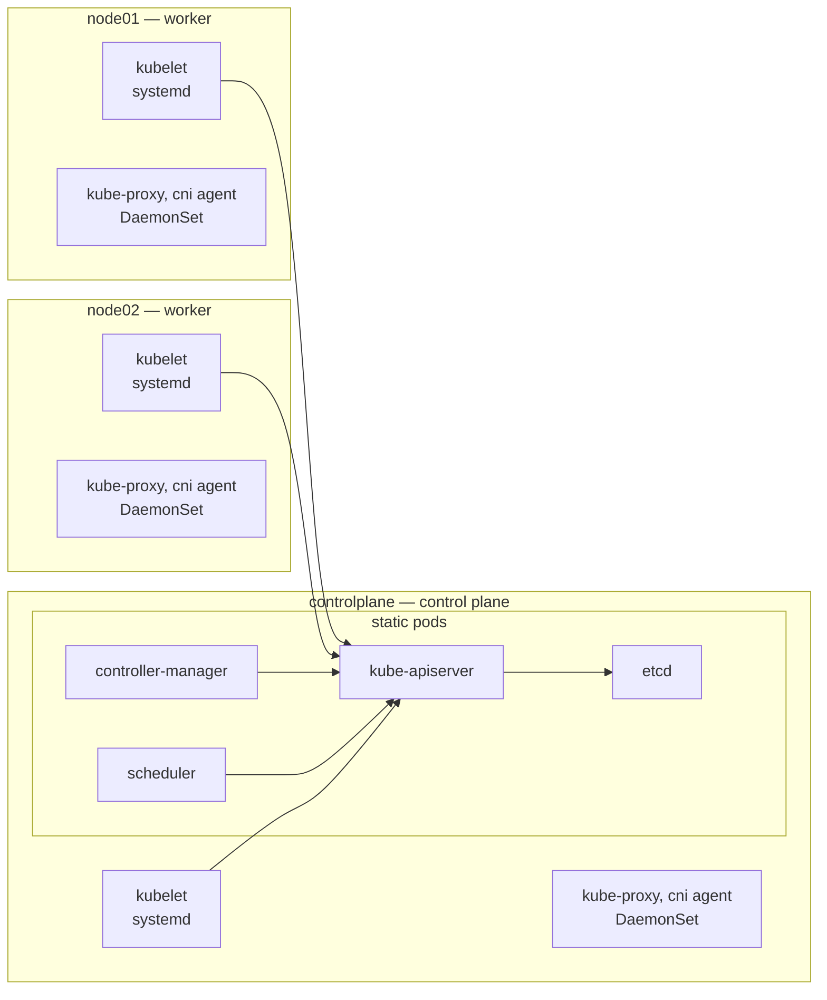
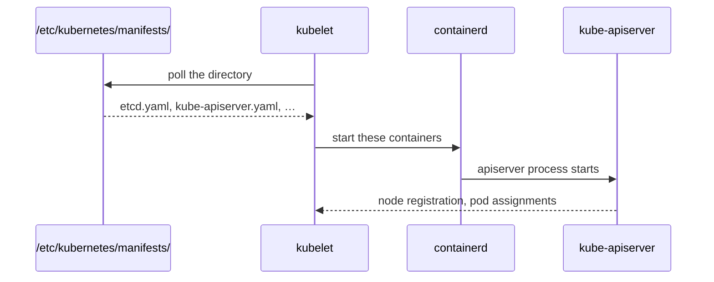

# Control plane

The set of components that decide what the cluster should be running. Workloads
run on nodes; the control plane records intent and drives reality toward it.

In this lab the control plane is a single node, `controlplane`.



Each box carries how it is deployed, because that decides how it restarts and
where its logs are. Only the apiserver talks to etcd; everything else talks to
the apiserver. A worker is a control plane node minus the static pods.

## Components

| Component | Job | Where kubeadm puts it |
| --- | --- | --- |
| `kube-apiserver` | The only door to cluster state. Everything else — kubectl, kubelets, controllers — talks to it and never to etcd. Serves on 6443. | static pod |
| `etcd` | Key-value store holding all cluster state. Losing it loses the cluster; backups are their own exam topic. | static pod |
| `kube-controller-manager` | One process running many [controllers](https://kubernetes.io/docs/concepts/architecture/controller/), each a loop comparing desired to actual and acting on the gap (node health, replica counts, service accounts). | static pod |
| `kube-scheduler` | Assigns unscheduled pods to nodes by filtering then scoring. Only writes `spec.nodeName`; the kubelet does the starting. | static pod |
| `kubelet` | On *every* node, control plane included. Starts containers, reports node and pod status. | systemd unit, not a pod |
| `kube-proxy` | On every node. Programs iptables/IPVS so Service IPs work. | DaemonSet |

`kubectl get pods -n kube-system` shows all of these except the kubelet.
`systemctl status kubelet` and `journalctl -u kubelet` for that one.

## Static pods

A pod defined by a file in `/etc/kubernetes/manifests/` rather than by an API
object. The kubelet watches that directory directly, so static pods start with no
apiserver and no scheduler involved — which is how the apiserver itself boots.



The apiserver is an output of this loop, not a participant in it. Nothing above
the last line requires a working cluster.

Consequences worth internalising:

- Editing a manifest file restarts that component within seconds. This is how the
  apiserver gets reconfigured, and how the upgrade and troubleshooting exercises
  break it.
- `kubectl delete pod kube-apiserver-controlplane` does nothing lasting; the kubelet
  recreates it from the file.
- Static pods are named `<manifest-name>-<node-name>`, e.g. `etcd-controlplane`.
- The directory is root-only (`sudo ls /etc/kubernetes/manifests/`).

## Control plane taint

`kubeadm init` taints the control plane node
`node-role.kubernetes.io/control-plane:NoSchedule` so ordinary workloads stay
off it. CNI and kube-proxy pods tolerate the taint, which is why they still land
there. Removing the taint is how a single-node cluster runs workloads:

```bash
kubectl taint node controlplane node-role.kubernetes.io/control-plane-      # trailing dash removes
```

## Files kubeadm writes on the control plane node

| Path | Contents |
| --- | --- |
| `/etc/kubernetes/manifests/` | static pod manifests |
| `/etc/kubernetes/admin.conf` | admin kubeconfig, root-owned |
| `/etc/kubernetes/pki/` | CA and all component certificates |
| `/var/lib/etcd/` | etcd data directory |
| `/var/lib/kubelet/config.yaml` | kubelet configuration |

## Docs

- [Cluster architecture](https://kubernetes.io/docs/concepts/architecture/)
- [Kubernetes components](https://kubernetes.io/docs/concepts/overview/components/)
- [Static pods](https://kubernetes.io/docs/tasks/configure-pod-container/static-pod/)
- [Control plane–node communication](https://kubernetes.io/docs/concepts/architecture/control-plane-node-communication/)
- [Ports and protocols](https://kubernetes.io/docs/reference/networking/ports-and-protocols/)
- [Operating etcd](https://kubernetes.io/docs/tasks/administer-cluster/configure-upgrade-etcd/)
- [kube-scheduler](https://kubernetes.io/docs/concepts/scheduling-eviction/kube-scheduler/)

Related: [pod](pod.md), [workers](workers.md), [pod-network](pod-network.md),
[kubeconfig](kubeconfig.md).
