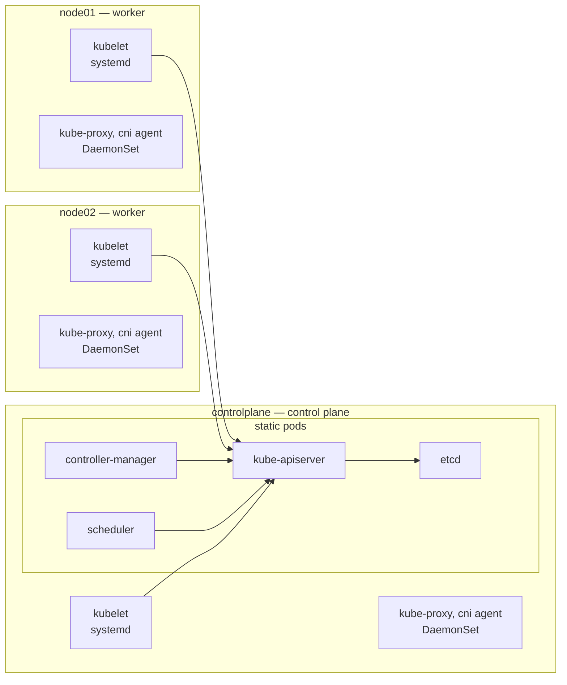
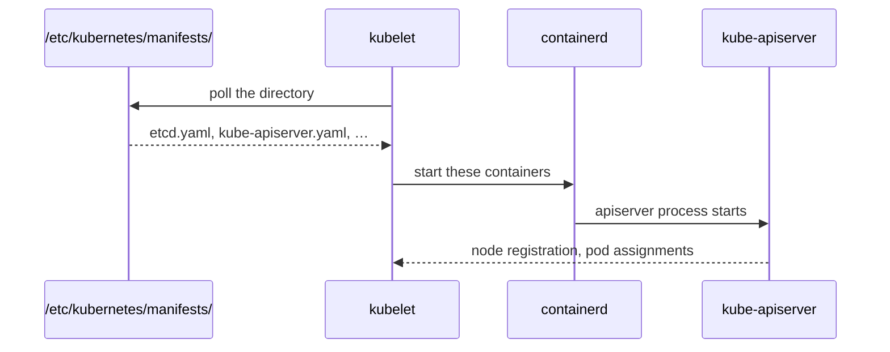

# Control plane

The control plane is the set of components that store the cluster's desired state and act to
make the nodes match it. Workloads run on nodes.

In this lab the control plane is a single node, `controlplane`.



Each box names how it is deployed ([components](#components), [static pods](#static-pods)),
which decides how it restarts and where its logs are. Only the apiserver talks to etcd, and everything else talks to the
apiserver. A worker is a control plane node without the static pods. kube-proxy
and the pod network agent run as [DaemonSets](daemonsets.md).

## Components

| Component | What it does | Where kubeadm puts it |
| --- | --- | --- |
| [`kube-apiserver`](https://kubernetes.io/docs/reference/command-line-tools-reference/kube-apiserver/) | The only door to cluster state. Everything else — kubectl, kubelets, controllers — talks to it and never to etcd. Serves on 6443. | static pod |
| [`etcd`](https://kubernetes.io/docs/tasks/administer-cluster/configure-upgrade-etcd/) | Key-value store holding all cluster state. | static pod |
| `kube-controller-manager` | One process running many [controllers](https://kubernetes.io/docs/concepts/architecture/controller/), each a loop comparing desired to actual and acting on the gap (node health, replica counts, service accounts). | static pod |
| [`kube-scheduler`](https://kubernetes.io/docs/concepts/scheduling-eviction/kube-scheduler/) | Assigns unscheduled pods to nodes by filtering then scoring. Only writes `spec.nodeName`; the kubelet does the starting. | static pod |
| [`kubelet`](https://kubernetes.io/docs/reference/command-line-tools-reference/kubelet/) | On *every* node, control plane included. Starts containers, reports node and pod status. | systemd unit, not a pod |
| [`kube-proxy`](https://kubernetes.io/docs/reference/command-line-tools-reference/kube-proxy/) | On every node. Programs iptables/IPVS so [Service](services.md) IPs work. | DaemonSet |

A controller is a loop that compares the state an object asks for with what exists, and acts on
the difference, such as creating a pod when a [Deployment](workloads.md) has too few.

`kubectl get pods -n kube-system` shows all of these except the kubelet.
`systemctl status kubelet` and `journalctl -u kubelet` for that one.

## Static pods

A static pod is a pod defined by a file in `/etc/kubernetes/manifests/` rather than
by an API object. The kubelet watches that directory directly, so static pods start with no
apiserver and no scheduler involved. That is how the apiserver itself starts.
Official task page: [create static pods](https://kubernetes.io/docs/tasks/configure-pod-container/static-pod/).



Because the kubelet reads the files directly:

- Editing a [manifest](exam-workflow.md#generating-yaml) file restarts that component within seconds. This is how a
  control plane component is reconfigured.
- Deleting a static pod with `kubectl delete pod` does nothing lasting. In the lab,
  `kube-scheduler-controlplane` is back `Running` 5 seconds after it is deleted,
  because the kubelet recreates it from the file.
- The pod object the apiserver shows is a mirror of the file, and its owner is the
  [Node](workers.md), not a controller.
- Static pods are named `<manifest-name>-<node-name>`, e.g. `etcd-controlplane`.
- Anyone can list the directory, but the manifest files are root-only (mode `600`), so
  reading or editing one needs `sudo`.

## Control plane taint

`kubeadm init` [taints](taints.md) the control plane node
`node-role.kubernetes.io/control-plane:NoSchedule` so ordinary workloads stay
off it ([taints and tolerations](https://kubernetes.io/docs/concepts/scheduling-eviction/taint-and-toleration/)). [CNI](pod-network.md) and kube-proxy pods tolerate the taint, which is why they still land
there. Removing the taint is how a single-node cluster runs workloads:

```bash
kubectl taint node controlplane node-role.kubernetes.io/control-plane-      # trailing dash removes
```

## Files kubeadm writes on the control plane node

Listed on [kubeadm](kubeadm.md).

## Docs

- [Cluster architecture](https://kubernetes.io/docs/concepts/architecture/)
- [Kubernetes components](https://kubernetes.io/docs/concepts/overview/components/)
- [Static pods](https://kubernetes.io/docs/tasks/configure-pod-container/static-pod/)
- [Control plane–node communication](https://kubernetes.io/docs/concepts/architecture/control-plane-node-communication/)
- [Ports and protocols](https://kubernetes.io/docs/reference/networking/ports-and-protocols/)
- [Operating etcd](https://kubernetes.io/docs/tasks/administer-cluster/configure-upgrade-etcd/)
- [kube-scheduler](https://kubernetes.io/docs/concepts/scheduling-eviction/kube-scheduler/)

Related: [kubeadm](kubeadm.md), [pod](pod.md), [workers](workers.md), [pod-network](pod-network.md),
[kubeconfig](kubeconfig.md).
