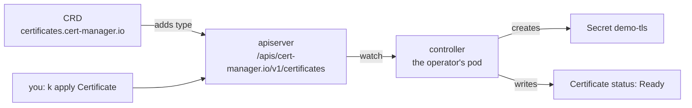

# CRDs and operators

A CustomResourceDefinition (CRD) adds a resource type to the apiserver without changing Kubernetes itself. The apiserver then stores, validates and serves objects of the new type like built-in ones ([custom resources](https://kubernetes.io/docs/concepts/extend-kubernetes/api-extension/custom-resources/#custom-resources)). A CRD adds no behaviour. An operator is a controller that watches those objects and makes the cluster match them ([operator pattern](https://kubernetes.io/docs/concepts/extend-kubernetes/operator/#operators-in-kubernetes)).

## What a CRD adds

A CRD is itself an object, of the cluster-scoped type `customresourcedefinitions` (short names `crd`, `crds`) in the group `apiextensions.k8s.io`. Creating one adds a REST path for each version it serves, `/apis/<group>/<version>/<plural>` ([create a CustomResourceDefinition](https://kubernetes.io/docs/tasks/extend-kubernetes/custom-resources/custom-resource-definitions/#create-a-customresourcedefinition)). After that, `kubectl get`, `apply`, `delete`, `explain`, RBAC rules and `-n` all work with the new type as with any other.



Deleting a CRD deletes every object of its type, in every namespace ([delete a CustomResourceDefinition](https://kubernetes.io/docs/tasks/extend-kubernetes/custom-resources/custom-resource-definitions/#delete-a-customresourcedefinition)).

## The parts of a CRD

| Field | Holds |
| --- | --- |
| `metadata.name` | `<plural>.<group>`, such as `crontabs.stable.example.com`. Any other name is rejected with `must be spec.names.plural+"."+spec.group`. |
| `spec.group` | The API group, the part of `apiVersion` before the slash ([API groups](api-groups.md)). |
| `spec.versions[]` | Each version's `name`, whether it is `served`, which one is the `storage` version (exactly one), and its `schema`. |
| `spec.scope` | `Namespaced` or `Cluster` ([namespaces](namespaces.md)). |
| `spec.names` | `plural`, `singular`, `kind`, and optional `shortNames`. |

The `CronTab` example on the docs page has every field, with a comment on each. Copy it, then change the names, the group and the fields under `spec.properties`.

## Schemas and validation

Each version has an `openAPIV3Schema` describing the object's fields and their types ([specifying a structural schema](https://kubernetes.io/docs/tasks/extend-kubernetes/custom-resources/custom-resource-definitions/#specifying-a-structural-schema)). The apiserver checks every object against it:

- A value of the wrong type is rejected: `spec.replicas in body must be of type integer`.
- A field the schema does not list is rejected by `kubectl apply`, which asks for strict field validation by default: `strict decoding error: unknown field "spec.colour"` ([field validation](https://kubernetes.io/docs/reference/using-api/api-concepts/#field-validation)).
- `k explain <kind>.<field>` reads the schema, so it works for custom types too. Fields marked `-required-` must be set.

## Operators

An operator is a controller, running in pods, that watches its custom resources and reconciles: it compares what the object asks for with what exists, and creates, changes or deletes objects until they match ([operator pattern](https://kubernetes.io/docs/concepts/extend-kubernetes/operator/#operators-in-kubernetes)). It reports progress in the custom resource's `status`, which is what a `READY` column shows.

Installing an operator means installing its CRDs and its controller, usually as a Deployment ([deploying operators](https://kubernetes.io/docs/concepts/extend-kubernetes/operator/#deploying-operators)). The controller also needs a ServiceAccount with RBAC permission for the objects it manages, which its chart or manifest includes. Configuring it means creating custom resources, never editing what it created: a Secret deleted by hand is created again within seconds, because the custom resource still asks for it.

In the lab, cert-manager runs three Deployments, `cert-manager`, `cert-manager-cainjector` and `cert-manager-webhook`, and adds six CRDs. A `Certificate` makes the controller create a `CertificateRequest` and then a `kubernetes.io/tls` Secret, acting as `system:serviceaccount:cert-manager:cert-manager`.

## CRDs from Helm charts

A chart can ship CRDs in two ways ([Helm and CRDs](https://helm.sh/docs/topics/charts/#custom-resource-definitions-crds)):

- In the chart's `crds/` folder. Helm installs them before anything else, only on `install`, and never upgrades or deletes them. `--skip-crds` leaves them out.
- As ordinary templates, switched on by a value. cert-manager does this: without `--set crds.enabled=true`, its chart renders no CRDs at all, and with it, six.

`helm template` shows which applies: `helm template x <chart> | grep -c '^kind: CustomResourceDefinition'`. See [helm](helm.md).

## Commands

```bash
k get crd                                          # every CRD in the cluster
k get crd -o name | grep cert-manager > crds.txt   # names only, for a file
k api-resources --api-group=cert-manager.io        # the types a group adds, with kinds and short names
k explain certificate.spec                         # fields, with -required- marked
k explain certificate.spec.subject > subject.txt   # one field's documentation, for a file
k wait --for=condition=Established crd/crontabs.stable.example.com
k get certificate -A                               # custom objects work like built-in ones
k delete crd crontabs.stable.example.com           # deletes every CronTab too
```

## Failure modes

| Symptom | Cause |
| --- | --- |
| `error: couldn't find resource for "stable.example.com/v1, Resource=crontabs"` from `k explain` | The CRD was created a moment ago and is not `Established` yet. `k wait --for=condition=Established crd/<name>`, then retry. |
| `The CronTab "bad" is invalid: spec.replicas: Invalid value: "string": spec.replicas in body must be of type integer: "string"` | The value does not match the schema's type. |
| `strict decoding error: unknown field "spec.colour"` | The schema has no such field. Check the name with `k explain`. |
| `The Certificate "nope" is invalid: spec.secretName: Required value` | A required field is missing. `k explain <kind>.spec` marks them `-required-`. |
| `Error from server (NotFound): Unable to list "stable.example.com/v1, Resource=crontabs": the server could not find the requested resource` | The CRD does not exist, or was deleted along with its objects. |
| A chart installs and `k get crd` shows none of its types | The chart templates its CRDs behind a value, such as `crds.enabled=true`. |

## Docs

- [Custom Resources](https://kubernetes.io/docs/concepts/extend-kubernetes/api-extension/custom-resources/)
- [Extend the Kubernetes API with CustomResourceDefinitions](https://kubernetes.io/docs/tasks/extend-kubernetes/custom-resources/custom-resource-definitions/)
- [Operator pattern](https://kubernetes.io/docs/concepts/extend-kubernetes/operator/)
- [cert-manager: installing with Helm](https://cert-manager.io/docs/installation/helm/) (not available in the exam)
