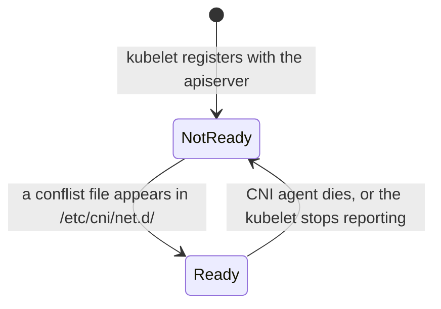

# Pod network

Kubernetes requires that every pod gets its own IP and that any pod can reach any other pod on any node without NAT ([the Kubernetes network model](https://kubernetes.io/docs/concepts/services-networking/#the-kubernetes-network-model)). Kubernetes does not implement this. A [CNI plugin](https://kubernetes.io/docs/concepts/extend-kubernetes/compute-storage-net/network-plugins/) does, and kubeadm installs none — so a freshly `init`ed cluster is deliberately incomplete.

## Three CIDRs, not one

| Range | Set by | Default | Who lives there |
| --- | --- | --- | --- |
| Pod CIDR | [`kubeadm init`](https://kubernetes.io/docs/reference/setup-tools/kubeadm/kubeadm-init/) `--pod-network-cidr` | none | pods |
| Service CIDR | `kubeadm init --service-cidr` | `10.96.0.0/12` | ClusterIPs |
| Node network | the infrastructure | lima `user-v2`: `192.168.104.0/24` | node interfaces |


Service IPs are the odd ones out: no interface anywhere holds one. They exist only as iptables/IPVS rules that kube-proxy writes ([virtual IPs](https://kubernetes.io/docs/reference/networking/virtual-ips/)) on every node, which is why a ClusterIP answers but never appears in `ip addr`.

All three must be disjoint. The controller-manager carves the pod CIDR into a per-node `/24` (see `kubectl get node controlplane -o jsonpath='{.spec.podCIDR}'`), and the CNI plugin's own configuration must agree with the pod CIDR given to `init`. **Disagreement is the single most common bootstrap failure** — nodes stay `NotReady`, or pods get IPs that cannot route.

## Until a CNI exists

- Node condition `Ready` is `False`, reason `KubeletNotReady`, message `container runtime network not ready: NetworkReady=false reason:NetworkPluginNotReady message:Network plugin returns error: cni plugin not initialized` (wording after the first clause varies by kubelet version)
- CoreDNS pods stay `Pending`
- `/etc/cni/net.d/` is empty (root-only directory: `sudo ls /etc/cni/net.d/`)

After a CNI installs, that directory holds a `*.conflist` — `10-flannel.conflist` for Flannel — and the kubelet flips the node to `Ready` within a minute.



One file is the whole gate. A node that will not go `Ready` on a fresh cluster is a question about that directory, not about the apiserver.

## Plugins

Flannel — simplest, no policy support, defaults to `10.244.0.0/16`:

```bash
kubectl apply -f https://github.com/flannel-io/flannel/releases/latest/download/kube-flannel.yml
```

Calico — supports [NetworkPolicy](https://kubernetes.io/docs/concepts/services-networking/network-policies/), defaults to `192.168.0.0/16`, so its manifest needs editing unless `init` used that range. NetworkPolicy exercises need a plugin that enforces it; Flannel silently ignores policies.

CNI pods run as a DaemonSet and tolerate the control plane taint, which is why they schedule onto `controlplane` before the node is `Ready`. Flannel puts its DaemonSet in a `kube-flannel` namespace of its own, so `kubectl get pods -n kube-system` does not show it — use `-A`.

## CoreDNS

Cluster DNS, a Deployment of two replicas in `kube-system`, reachable at the service `kube-dns` on `10.96.0.10`. It resolves `<service>.<namespace>.svc.cluster.local` ([DNS for services and pods](https://kubernetes.io/docs/concepts/services-networking/dns-pod-service/)). Being an ordinary Deployment, it needs the pod network first — hence its usefulness as the readiness signal.

## Docs

- [Cluster networking](https://kubernetes.io/docs/concepts/cluster-administration/networking/)
- [Network plugins](https://kubernetes.io/docs/concepts/extend-kubernetes/compute-storage-net/network-plugins/)
- [DNS for services and pods](https://kubernetes.io/docs/concepts/services-networking/dns-pod-service/)
- [Customising CoreDNS](https://kubernetes.io/docs/tasks/administer-cluster/dns-custom-nameservers/)
- [Flannel](https://github.com/flannel-io/flannel) · [Calico quickstart](https://docs.tigera.io/calico/latest/getting-started/kubernetes/quickstart)

The exam permits the docs of any CNI vendor a task names.

Related: [pod](pod.md), [workers](workers.md), [control-plane](control-plane.md).
