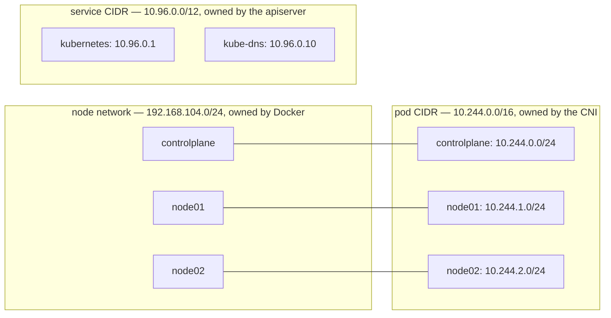
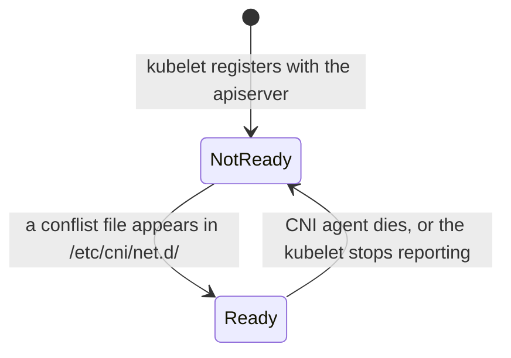

# Pod network

Kubernetes requires that every pod gets its own IP and that any pod can reach any other pod on any node without NAT ([the Kubernetes network model](https://kubernetes.io/docs/concepts/services-networking/#the-kubernetes-network-model)). Kubernetes does not implement this. A [CNI plugin](https://kubernetes.io/docs/concepts/extend-kubernetes/compute-storage-net/network-plugins/) does, and [kubeadm](kubeadm.md) installs none.

## Three CIDRs, not one

| Range | Set by | Default | Who lives there |
| --- | --- | --- | --- |
| Pod CIDR | [`kubeadm init`](https://kubernetes.io/docs/reference/setup-tools/kubeadm/kubeadm-init/) `--pod-network-cidr` | none | pods |
| Service CIDR | `kubeadm init --service-cidr` | `10.96.0.0/12` | ClusterIPs |
| Node network | the infrastructure | in the lab, the Docker network `cka-lab`: `192.168.104.0/24` | node interfaces |



Service IPs are the odd ones out: no interface anywhere holds one. They exist only as iptables/IPVS rules that kube-proxy writes ([virtual IPs](https://kubernetes.io/docs/reference/networking/virtual-ips/)) on every node, which is why a ClusterIP answers but never appears in `ip addr`.

All three must be disjoint. The controller-manager splits the pod CIDR into a `/24` per node and records it in the node's `spec.podCIDR`. In the lab:

```
NAME           CIDR
controlplane   10.244.0.0/24
node01         10.244.1.0/24
node02         10.244.2.0/24
```

The plugin's own configuration must contain those ranges. Flannel's is `10.244.0.0/16`. When they disagree, the Flannel pods crash-loop and CoreDNS stays in `ContainerCreating`, but the nodes still go `Ready` (see below). The Flannel log names the cause:

| `init` was given | Flannel log |
| --- | --- |
| `--pod-network-cidr 10.10.0.0/16` | `failed to acquire lease: subnet "10.244.0.0/16" specified in the flannel net config doesn't contain "10.10.0.0/24" PodCIDR of the "controlplane" node` |
| no `--pod-network-cidr` | `failed to acquire lease: node "controlplane" pod cidr not assigned` |

Read it with `kubectl logs -n kube-flannel -l app=flannel`.

## Until a CNI exists

- Node condition `Ready` is `False`, reason `KubeletNotReady`, message `container runtime network not ready: NetworkReady=false reason:NetworkPluginNotReady message:Network plugin returns error: cni plugin not initialized` (wording after the first clause varies by kubelet version)
- CoreDNS pods stay `Pending`, because a `NotReady` node carries the taint `node.kubernetes.io/not-ready:NoSchedule`, which CoreDNS does not tolerate
- `/etc/cni/net.d/` is empty (root-only directory: `sudo ls /etc/cni/net.d/`)

After a CNI installs, that directory holds a `*.conflist`, `10-flannel.conflist` for Flannel, and the kubelet marks the node `Ready`. In the lab this takes 16 seconds.



The file is the only thing the kubelet checks. Flannel's `install-cni` init container copies it in before the Flannel agent starts, so the node goes `Ready` even when the agent then crash-loops. `Ready` means the configuration exists. Both CoreDNS pods `Running` means pods are getting addresses.

## Plugins

Flannel defaults to `10.244.0.0/16` and does not enforce NetworkPolicy ([Flannel](https://github.com/flannel-io/flannel) (not available in the exam)):

```bash
kubectl apply -f https://github.com/flannel-io/flannel/releases/latest/download/kube-flannel.yml
```

Calico enforces [NetworkPolicy](https://kubernetes.io/docs/concepts/services-networking/network-policies/) and defaults to `192.168.0.0/16`, so its manifest needs editing unless `init` used that range. With Flannel, a NetworkPolicy is accepted and has no effect.

The plugin's pods run as a [DaemonSet](daemonsets.md) that tolerates `NoSchedule` taints, so they start on `controlplane` while it is still `NotReady`. Flannel puts its DaemonSet in a [namespace](namespaces.md) of its own, `kube-flannel`, so `kubectl get pods -n kube-system` does not show it. Use `-A`.

## Pods on the host network

A pod with `hostNetwork: true` uses the node's own network and address instead of one from the pod CIDR ([pod networking](https://kubernetes.io/docs/concepts/workloads/pods/#pod-networking)). The control plane static pods, kube-proxy and the Flannel agent all do, which is why they run before any pod network exists:

```
NAME                                   HOSTNET
coredns-66bc5c9577-7s2xq               <none>
etcd-controlplane                      true
kube-apiserver-controlplane            true
kube-proxy-4wdrl                       true
```

So in `kubectl get pods -A -o wide`, these pods show the node's address, `192.168.104.x`, and only CoreDNS shows a `10.244.x` address.

## CoreDNS

Cluster DNS, a Deployment of two replicas in `kube-system`, reachable at the service `kube-dns` on `10.96.0.10`. It resolves `<service>.<namespace>.svc.cluster.local` ([DNS for services and pods](https://kubernetes.io/docs/concepts/services-networking/dns-pod-service/)). It does not use the host network, so it needs an address from the pod network.

## Docs

- [Cluster networking](https://kubernetes.io/docs/concepts/cluster-administration/networking/)
- [Network plugins](https://kubernetes.io/docs/concepts/extend-kubernetes/compute-storage-net/network-plugins/)
- [DNS for services and pods](https://kubernetes.io/docs/concepts/services-networking/dns-pod-service/)
- [Customising CoreDNS](https://kubernetes.io/docs/tasks/administer-cluster/dns-custom-nameservers/)
- [Flannel](https://github.com/flannel-io/flannel) · [Calico quickstart](https://docs.tigera.io/calico/latest/getting-started/kubernetes/quickstart) (not available in the exam)

The exam allows the documentation a task links in its Quick Reference box, which is where a plugin's docs would come from ([resources allowed](https://docs.linuxfoundation.org/tc-docs/certification/certification-resources-allowed) (not available in the exam)).

Related: [kubeadm](kubeadm.md), [pod](pod.md), [workers](workers.md), [control-plane](control-plane.md).
