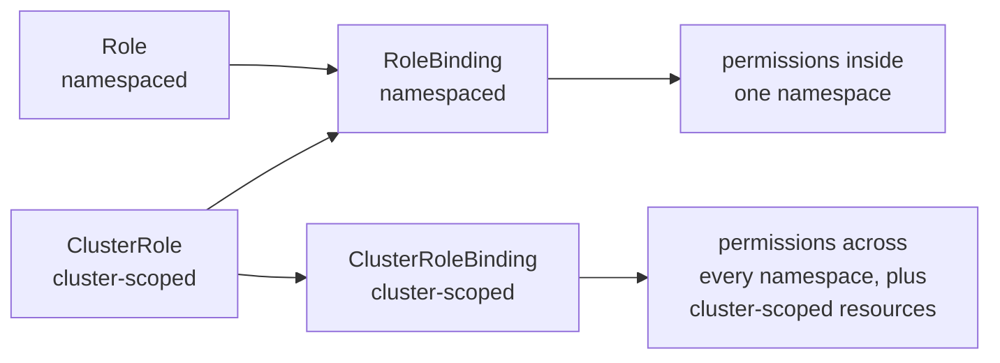

# RBAC

Authorisation in Kubernetes. Every request the apiserver accepts has already been
authenticated into a subject; RBAC decides whether that subject may perform that
verb on that resource.

## The model

Four objects, in two pairs. One pair defines permissions, the other grants them —
a permission that is never bound grants nothing.

| | Defines what | Grants it to whom |
| --- | --- | --- |
| Namespaced | [`Role`](https://kubernetes.io/docs/reference/access-authn-authz/rbac/#role-and-clusterrole) | [`RoleBinding`](https://kubernetes.io/docs/reference/access-authn-authz/rbac/#rolebinding-and-clusterrolebinding) |
| Cluster-wide | [`ClusterRole`](https://kubernetes.io/docs/reference/access-authn-authz/rbac/#role-and-clusterrole) | [`ClusterRoleBinding`](https://kubernetes.io/docs/reference/access-authn-authz/rbac/#rolebinding-and-clusterrolebinding) |

The pairs cross in one direction only:



A `RoleBinding` may reference a `ClusterRole`. The permissions still apply only
inside the binding's own namespace — the `ClusterRole` is being used as a reusable
definition, not as a cluster-wide grant. There is no path from a `Role` to a
`ClusterRoleBinding`; a namespaced definition cannot be granted cluster-wide.

## Subjects

Three kinds, named in a binding's `subjects` ([referring to subjects](https://kubernetes.io/docs/reference/access-authn-authz/rbac/#referring-to-subjects)):

- **ServiceAccount** — an in-cluster identity, referred to in full as
  `system:serviceaccount:<namespace>:<name>`. The only kind Kubernetes creates
  ([service-accounts](service-accounts.md)).
- **User** — has no object ([users in Kubernetes](https://kubernetes.io/docs/reference/access-authn-authz/authentication/#users-in-kubernetes)). A user exists because a certificate or token
  authenticates as that name ([authentication](authentication.md)). `kubeadm` writes `kubernetes-admin` into
  `admin.conf`.
- **Group** — also has no object, and comes from the same credential. `kubeadm`
  puts `kubernetes-admin` in the group `kubeadm:cluster-admins`, and binds *that
  group* to `cluster-admin`.

Permissions are purely additive. There is no deny rule, so a subject can do
something if any binding allows it, and removing access means removing bindings.

## In this lab

The `cluster` lab has 71 ClusterRoles. 65 are prefixed `system:` and let the
control plane components talk to the apiserver. `flannel` belongs to the pod
network and `kubeadm:get-nodes` to the bootstrap. The remaining four are meant
for people: `cluster-admin`, `admin`, `edit`, `view` ([user-facing roles](https://kubernetes.io/docs/reference/access-authn-authz/rbac/#user-facing-roles)).

Three ClusterRoleBindings give every authenticated subject a few permissions
before anyone grants it anything ([discovery roles](https://kubernetes.io/docs/reference/access-authn-authz/rbac/#discovery-roles)).
That is why `kubectl auth can-i --list` never comes back empty:

| ClusterRole | Lets any subject |
| --- | --- |
| `system:basic-user` | Ask what it is and what it may do: `selfsubjectreviews`, `selfsubjectaccessreviews`, `selfsubjectrulesreviews`. |
| `system:discovery` | Read the API's list of groups and types: `/api`, `/apis`, `/openapi`. |
| `system:public-info-viewer` | Read `/healthz`, `/livez`, `/readyz` and `/version`. Unauthenticated clients get this one too. |

Paths such as `/healthz` are non-resource URLs. They are not objects, so a rule
names them in `nonResourceURLs` rather than `resources`, and only a ClusterRole
can hold such a rule.

Your `kubectl` works because `~/.kube/config` is a copy of `admin.conf`, whose
certificate authenticates as `kubernetes-admin` in group `kubeadm:cluster-admins`,
which the `kubeadm:cluster-admins` ClusterRoleBinding binds to `cluster-admin`.

```bash
kubectl auth whoami
kubectl get clusterrolebinding kubeadm:cluster-admins -o wide
```

## Reading and testing permissions

`kubectl auth can-i` answers `yes` or `no` without needing the subject's
credentials, which is why it is the fastest tool under exam time:

```bash
kubectl auth can-i list pods -n dev --as=system:serviceaccount:dev:deploy-bot
kubectl auth can-i --list -n dev --as=system:serviceaccount:dev:deploy-bot
```

`--as` [impersonates](https://kubernetes.io/docs/reference/access-authn-authz/authentication/#user-impersonation) another subject ([authentication](authentication.md)), and works on any command, so a denied request can be seen in
full rather than as a bare `no`:

```
Error from server (Forbidden): pods is forbidden: User
"system:serviceaccount:dev:deploy-bot" cannot list resource "pods" in API group
"" in the namespace "prod"
```

The message names all five things a rule has to match: subject, verb, resource,
API group and namespace. Whichever one is wrong is the one to fix. `""` is the
core API group ([api-groups](api-groups.md)).

## Failure modes

| Symptom | Cause |
| --- | --- |
| Role exists, still `no` | Nothing bound it. A Role is a definition; the RoleBinding is the grant |
| Works in one namespace, not another | RoleBinding is namespaced. A second namespace needs a second binding |
| `no` on nodes, PVs, namespaces despite a binding | Cluster-scoped resources have no namespace for a RoleBinding to scope to ([namespaces](namespaces.md)). Needs a ClusterRoleBinding |
| Rule names the wrong API group | A hand-written rule says `apiGroups: [""]` for a type in a named group, such as `deployments` in `apps`. The Forbidden message prints the group it wanted |
| Verb missing | `get` does not imply `list`. `watch` is separate again |
| Binding names a subject that does not exist | Bindings are not validated against subjects. A typo in a ServiceAccount name binds nothing and reports no error |

## Docs

- [Using RBAC authorization](https://kubernetes.io/docs/reference/access-authn-authz/rbac/) — the page to open under exam time
- [Authorization overview](https://kubernetes.io/docs/reference/access-authn-authz/authorization/) · [ServiceAccounts](https://kubernetes.io/docs/concepts/security/service-accounts/)
- [`kubectl auth can-i`](https://kubernetes.io/docs/reference/kubectl/generated/kubectl_auth/kubectl_auth_can-i/) · [`kubectl create role`](https://kubernetes.io/docs/reference/kubectl/generated/kubectl_create/kubectl_create_role/) · [`kubectl create rolebinding`](https://kubernetes.io/docs/reference/kubectl/generated/kubectl_create/kubectl_create_rolebinding/)
