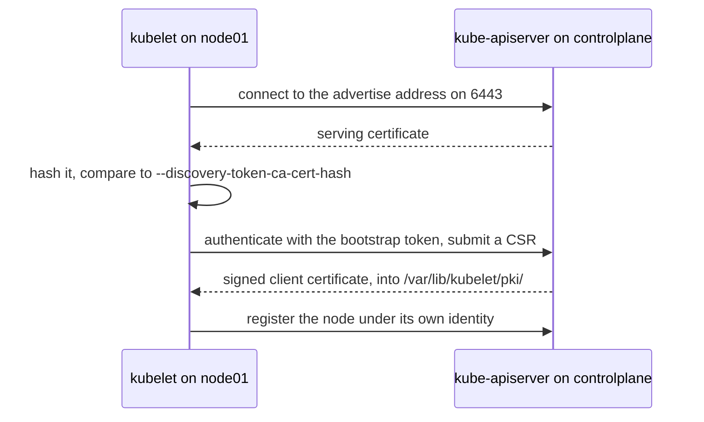

# Workers

A node that runs workloads. Nothing installed on it distinguishes it from the control plane node except the absence of control plane static pods — the prerequisites are identical (container runtime, kubelet, kubeadm, swap off, sysctls).

This lab has two: `node01`, `node02`.

## What a worker runs

- **kubelet** (systemd) — the only agent that starts containers. Registers the node, watches the apiserver for pods assigned to it, reports status.
- **container runtime** — containerd here, spoken to over CRI at `/run/containerd/containerd.sock`. Inspect with `crictl ps`, `crictl images` (not `docker`).
- **kube-proxy** and the **CNI agent**, both as DaemonSet pods.

A worker holds no kubeconfig for cluster administration, only `/etc/kubernetes/kubelet.conf` for its own identity. `kubectl` on a worker fails with `connection to the server localhost:8080 was refused` — expected; work from the control plane node.

## Joining

`kubeadm join <apiserver>:6443 --token <token> --discovery-token-ca-cert-hash sha256:<hash>`



Neither side trusts the other at the start, so the join line carries one secret in each direction: the hash proves the apiserver to the node, the token proves the node to the apiserver. The token's only power is getting a certificate signed — which is enough to justify the 24-hour expiry.

The token authenticates the node long enough to request a real client certificate ([TLS bootstrapping](https://kubernetes.io/docs/reference/access-authn-authz/kubelet-tls-bootstrapping/)); the CA hash lets the node verify the apiserver it is trusting. Tokens expire after 24 hours, so the line printed by `kubeadm init` goes stale — regenerate on the control plane node:

```bash
sudo kubeadm token create --print-join-command
```

`join` fails when the worker cannot reach the apiserver's advertise address on 6443, or when the node has stale state (`sudo kubeadm reset -f` clears it).

## Node conditions

`Ready` is one of several conditions; `kubectl describe node node01` shows all, plus allocatable resources and the pods placed there.

| Condition | Trouble it names |
| --- | --- |
| `Ready=False` | kubelet unhealthy, or no pod network on that node |
| `Ready=Unknown` | kubelet stopped reporting — node or kubelet is down |
| `MemoryPressure`, `DiskPressure`, `PIDPressure` | resource exhaustion; the kubelet starts evicting |

A node that goes `NotReady` gets its pods evicted after `--pod-eviction-timeout` (5 minutes by default), which is why a rebooted node looks fine but its pods have been recreated elsewhere.

## Roles

There is no role field. The ROLES column is rendered from labels named `node-role.kubernetes.io/<role>`, conventionally with an empty value:

```bash
kubectl label node node01 node02 node-role.kubernetes.io/worker=
```

`kubeadm` sets `node-role.kubernetes.io/control-plane=` on `controlplane` and applies a matching taint; it labels workers with nothing at all.

## Docs

- [Nodes](https://kubernetes.io/docs/concepts/architecture/nodes/)
- [kubeadm join](https://kubernetes.io/docs/reference/setup-tools/kubeadm/kubeadm-join/) · [kubeadm token](https://kubernetes.io/docs/reference/setup-tools/kubeadm/kubeadm-token/)
- [Bootstrap tokens](https://kubernetes.io/docs/reference/access-authn-authz/bootstrap-tokens/)
- [Container runtime interface](https://kubernetes.io/docs/concepts/architecture/cri/)
- [Labels](https://kubernetes.io/docs/concepts/overview/working-with-objects/labels/) · [well-known labels and taints](https://kubernetes.io/docs/reference/labels-annotations-taints/)
- [Installing kubeadm](https://kubernetes.io/docs/setup/production-environment/tools/kubeadm/install-kubeadm/)

Related: [control-plane](control-plane.md), [pod-network](pod-network.md), [pod](pod.md).
